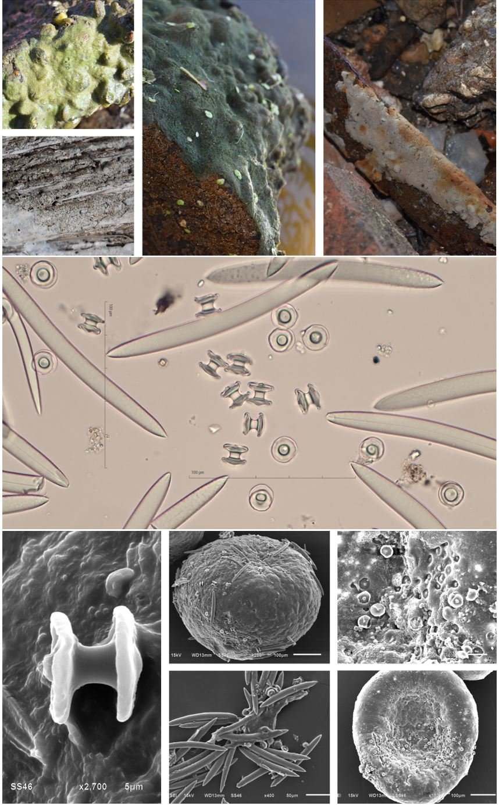

<style type="text/css">
h1.title {
  font-size: 40px;
  text-align: center;
}
body {
background-color: #B9F2FE
}
</style>
<br>
<br>

_T. leidyi_ has been found in brackish and freshwater in Louisiana. While the can 
grow in [lentic and lotic systems](https://en.wikipedia.org/wiki/River_ecosystem), most in the Louisiana study have been found in lotic water systems. It is easily identified when both sponge body and gemmules are present. They have banana shaped megascelers and birotulas that are embedded in the gemmules. Common substrates include rocks, wooden posts,metal objects, and bricks.

<br>

```{r setup, include=FALSE}
knitr::opts_chunk$set(echo = TRUE)
```

```{r, echo=FALSE, message=FALSE, warning=FALSE}
library(tidyverse)
library(sf)
library(rgdal)
library(sp)
library(readxl)
library(ggspatial)
library(ggmap)
library(RColorBrewer)
```

```{r echo=FALSE, results='hide', message=FALSE, warning=FALSE}
states<-st_read("/Users/abhimehrotra/Documents/states")
la.b<-st_crop(states,xmin=-94.15,xmax=-89,ymin=29,ymax=33.15)
la.c<-states[states$STATE_NAME=="Louisiana",]
sites<-read_xlsx("/Users/abhimehrotra/Desktop/Miller_sponge gps coordinates_summer 2021.xlsx", sheet="Tl")
```

```{r map, echo=FALSE, fig.align='center'}
(map1<-ggplot()+
    geom_sf(data=la.c)+
    geom_point(aes(x=Long,y=Lat, color=Tl),data=sites,size=2)+
    scale_color_brewer(palette = "Dark2",name="Trochospongilla leidyi")+
    ylab("Latitude")+
    xlab("Longitude")+
    theme(panel.grid = element_blank())+
    theme(legend.position="none")+
    theme(axis.text = element_text(size=10,family="sans"),
          axis.title= element_text(size=12,family="sans")))
```

<br>
<br>
<center>
{width=75%}
</center>
<br>
<br>

All preps and pictures were performed by BRCC students
and Dr. Miller and are copyright protected.