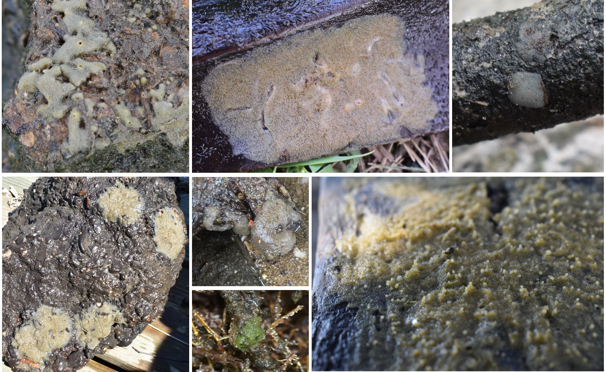

 

{width=75%}

 

Freshwater sponges are filter feeders that aid in cleaning water systems. Depending
on the [species](sponge_id.html) they can be found in [lentic and lotic ecosystems](https://sciencing.com/lentic-lotic-ecosystems-7355077.html). While these creatures are extremely understudied, we do know they can relay the health of the environment. However, many questions are still needed to be answered to address their actual dependency on water parameters. 
 
 
In this study, we have found that [_Eunapius fragilis_](Euf.html) and [_Trochospongilla horrida_](th.html) are the most abundant in Louisiana and are able to thrive in a range of water characteristics, indicating they are the ones most responsible for cleaning up the water systems, here. 

