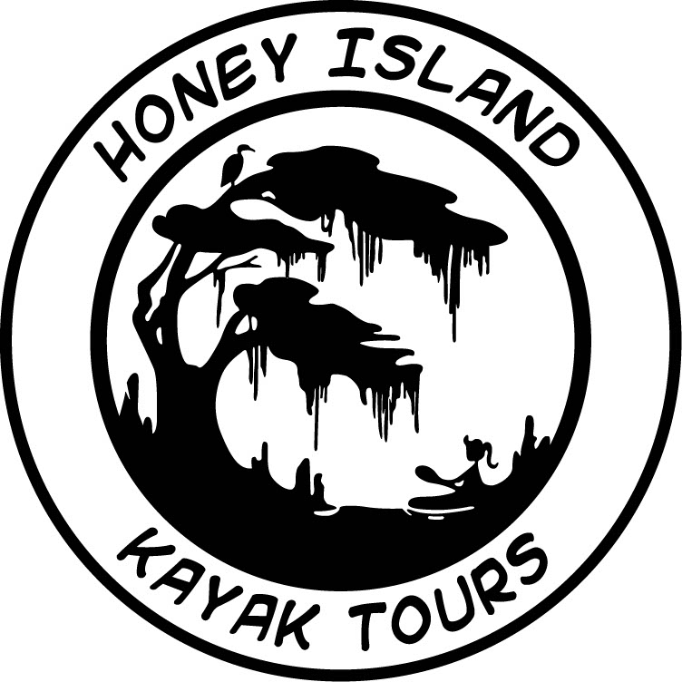

 
 

We are currently seeking funds to support BRCC students and local high school student
with internships along their journey of exploring the world of freshwater sponges. 

All donations are accepted through the BRCC foundation. Please contact Dr. Miller at millerm2@mybrcc.edu.for instructions to ensure your funds are allocated correctly. If you have questions about donations, you are welcome to call her at 225-216-8528.

Current personal supporters:
 
Michelle Watkins
 
Sondra LeBreton
 
 
Current corporation sponsors:
 
{width=25%}
 
