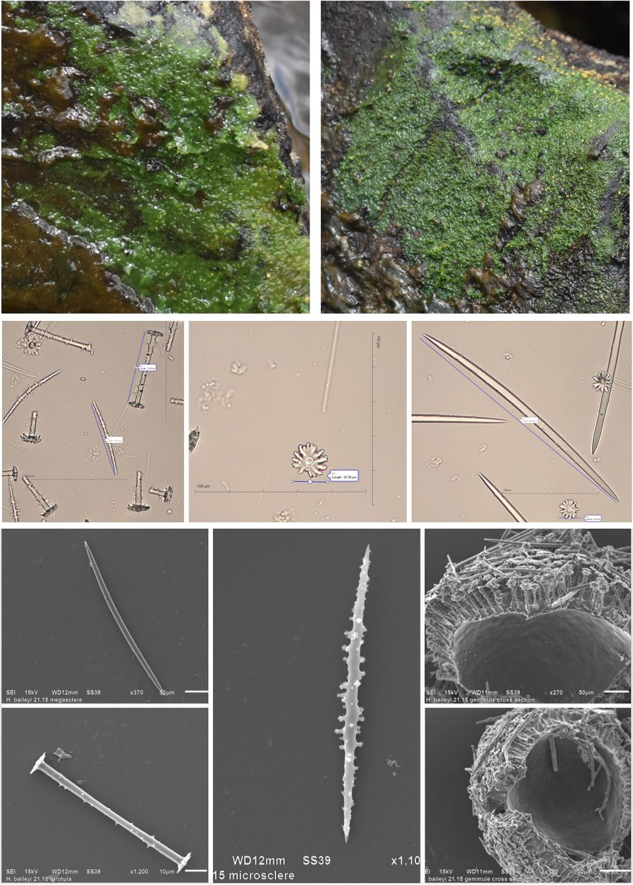

 
 
_H. baileyi_ has been found in one location of this study. It was found in a [lotic](https://en.wikipedia.org/wiki/River_ecosystem)
environment attached to rocks. 
 

{width=50%}

All preps and pictures were performed by BRCC students
and Dr. Miller and are copyright protected.