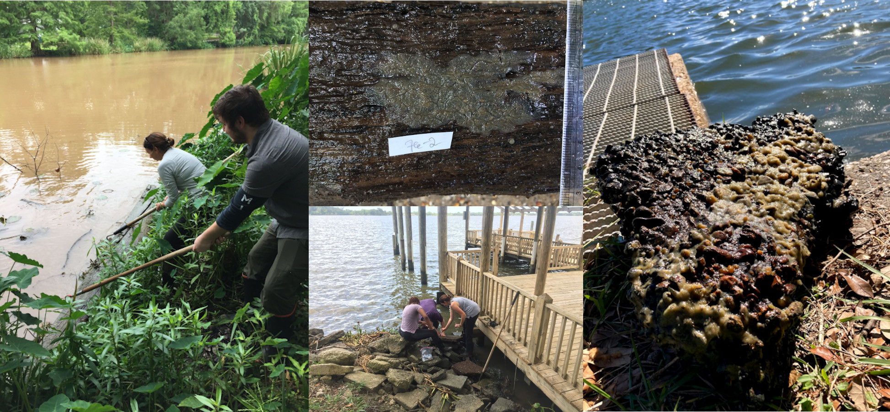
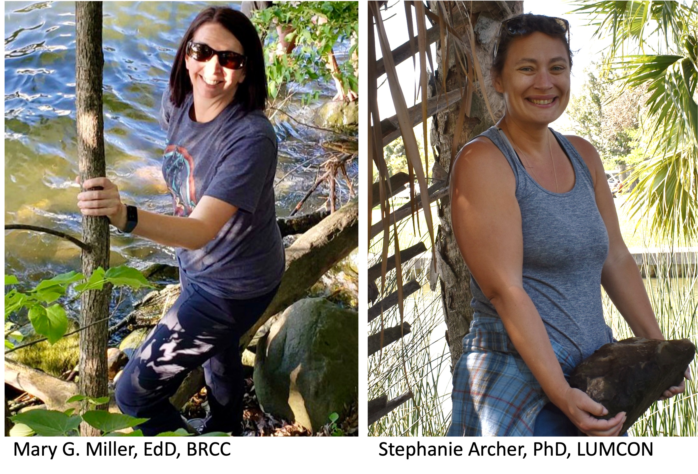

<style type="text/css">
H1.title {
  font-size: 48px;
  text-align: center;
}
body {
background-color: #B9F2FE
}
</style>
<center>
<h2>Home of the Louisiana Freshwater Sponge Hunters</h2>
</center>
<br>
<br>
```{r banner image,fig.align='center',out.width="100%",echo=FALSE,out.extra='style="background-color: #00637a; padding:18px; display: inline-block;"'}

```  
<br>
<br> 
Welcome to the Louisiana Freshwater Sponge Hunters page! 
<br>
<br>
This page is currently under construction and we are updating it often!
<br>
<br>
The Louisiana Freshwater Sponge Project was started by Dr. Mary Miller and a group
of interns through Baton Rouge Community College, in the Summer of 2019. The project was a follow up from the original survey that was conducted by [Dr. Michael Poirrier in 1968](https://core.ac.uk/download/pdf/217384297.pdf). 
<br>
**Aims of the Project:**
<br>
<br>
1. Bring awareness of freshwater sponges to the general public through [outreach](outreach.html) activities. 
<br>
2. Provide research experiences to [first and second year college students](student.html).
<br>
3. Continuously monitor the freshwater sponge population in Louisiana as environmental health indicators and to share those finding in scientific [journals](publications.html).
<br>
<br>
The project is now shared between two institutions:
<br>
<br>
[Baton Rouge Community College](https://www.mybrcc.edu/), still led by Dr. Miller, and 
[Louisiana Universities Marine Consortium](https://www.lumcon.edu/), led by Dr. Stephanie Archer. The two have continue to collaborate with Dr. Poirrier to identify sponges and answer questions related to these environmental health indicators.
<br>
<br>
<center>
{width=50%}
</center>
<br>

<br>
<br>
<br>
<br>
<br>
<br>
Scientific collection of sponges for this project is governed through the issued Louisiana Wildlife and Fisheries scientific collecting Permit #SCP202.
<br>
<br>
