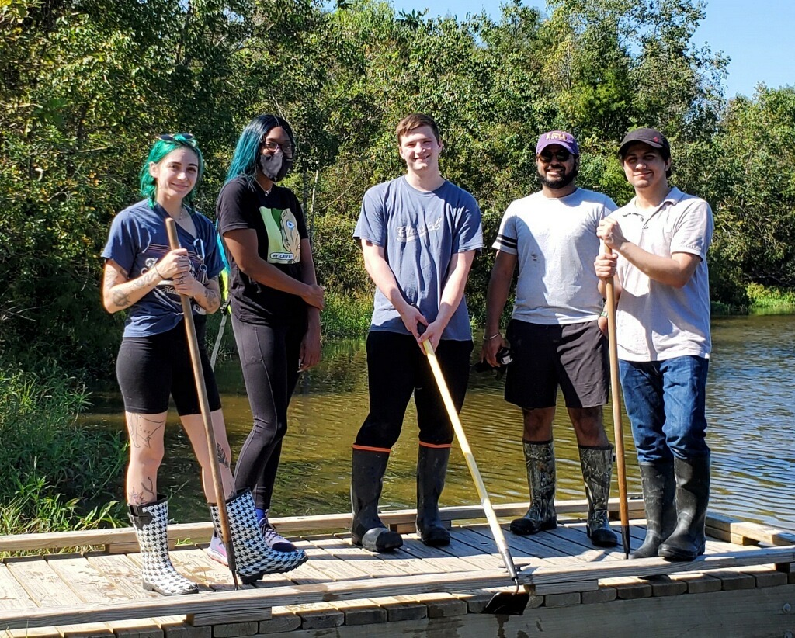
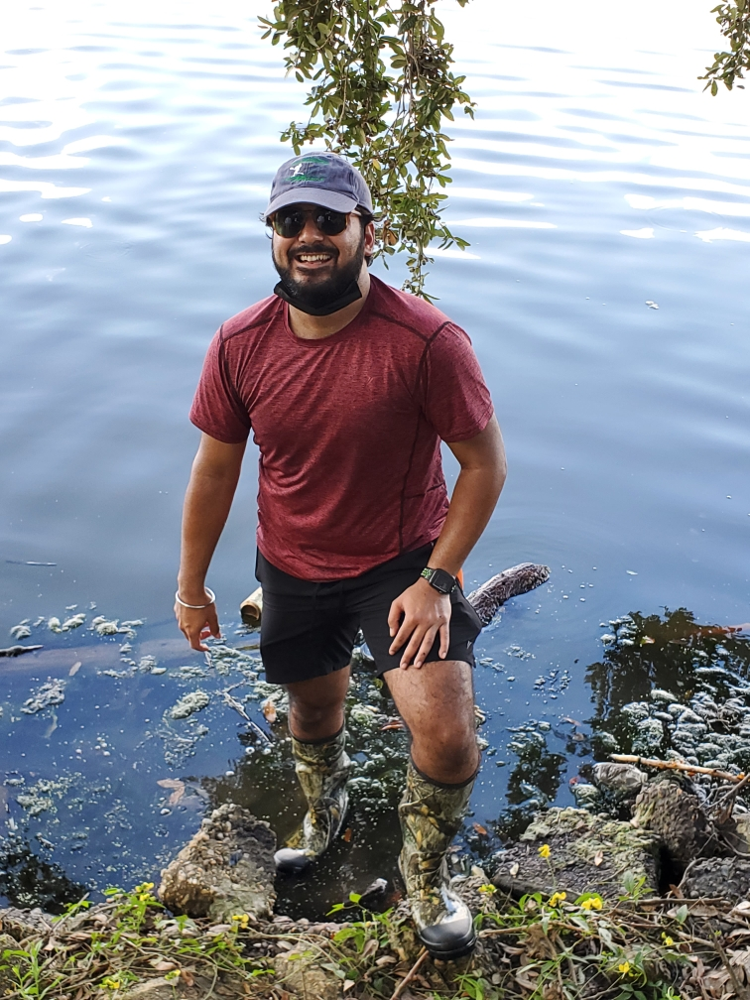
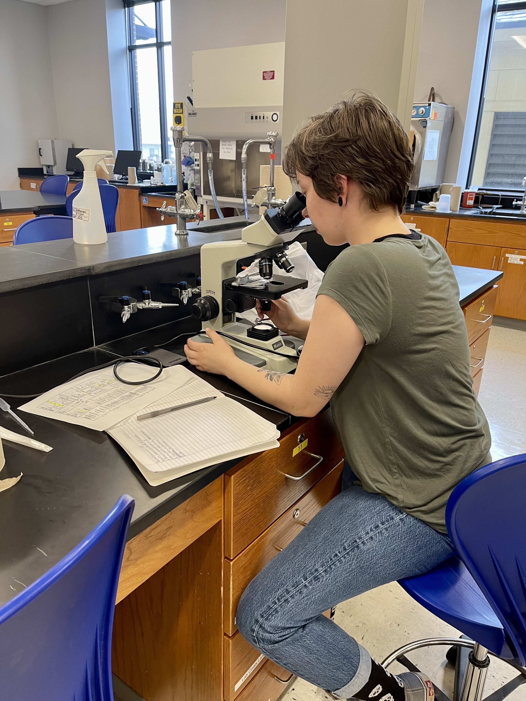
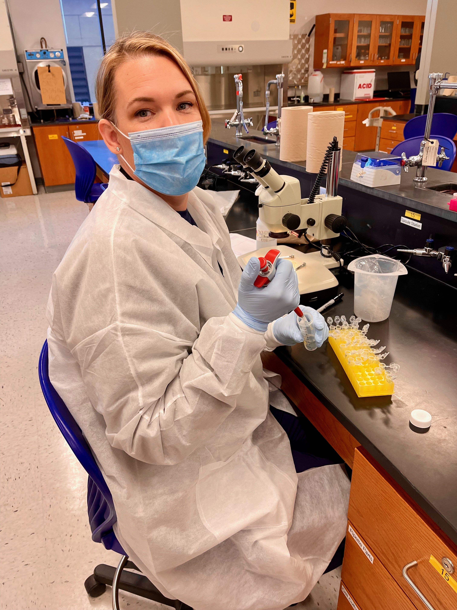
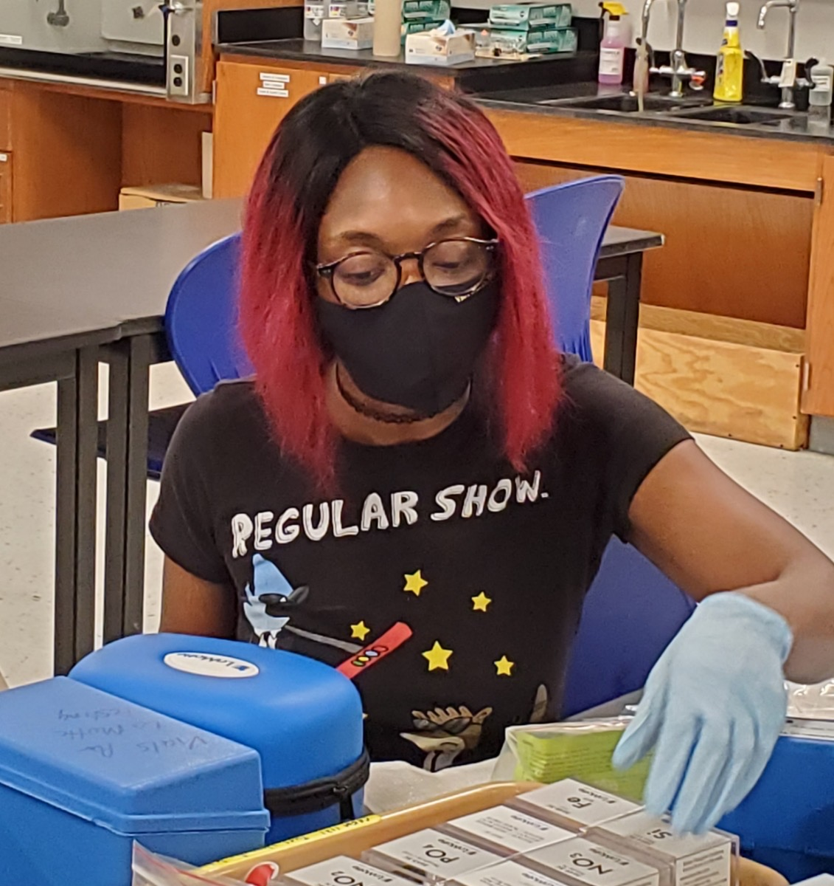

 
The Louisiana Freshwater Sponge Research Team consists of biology, computer science, and pre-engineering BRCC students. All have individual roles in the projects that come together to create an ongoing database that allows us to understand the health of freshwater sponges in Louisiana!
 
 

{width=75%}

 Pictured above (from left to right): Raven Skelton, Tarry Glover, Samuel Joseph Johnson, Abhi Mehrotra, and Axel  Henriquez. 

 
 

**Undergraduate Research Mentors:**
 
 
{width=25%}
 
Abhi Mehrotra
 
Summer 2021 -
 
"I am the first computer science major to have received the amazing opportunity to be part of The Louisiana Freshwater Sponge Project! My responsibilities in the lab include webmaster, data management, and I also do fieldwork as well. My goals are to graduate with an Associate of Science in Computer Science degree from BRCC and pursue a Bachelor of Science in Computer Science degree with a concentration in data science plus a minor in biological sciences."
 
 

**Undergraduate Student Researchers:**
 
 
{width=25%}
 
 
Amori Bieller
 
Spring 2022 -
 
"I work in the lab mainly doing spicule prep and major in general science with a focus on biology. I have worked in entomology and currently as an equine professional; which has heavily influenced my interest in animal behavior and career choice of wildlife biology."

 
 
{width=25%}
 
Hayley Howard
 
Summer 2022 - 
 
"I am currently majoring in natural resource ecology and management and my role in the Louisiana Freshwater Sponge Project is water analysis. After completing my Associates of Science Transfer degree, I hope to attend LSU to continue my education in wildlife ecology. A fun fact about me is that I have been a vegetarian for about 14 years now." 

 
 
{width=25%}
 
Lisa DiMaggio
 
Spring 2022 -
 
"I am currently a general science major. My future plans include a bachelor's degree in laboratory science and my career aspiration is to work in forensics. My role in the Louisiana Freshwater Sponge Project is spicule identification and sediment analysis."

 
 
{width=25%}
 
Tarry Glover
 
Summer 2020 -
 
"My name is Tarry Glover. I joined the Freshwater Sponge Project in 2020. I am responsible for molecular work which includes DNA isolation and PCR amplification. I also work with MEGA-X software and the NCBI database After I graduate, I plan on transferring to FranU and completing the medical laboratory science program."

 
 
{width=25%}
 
Kendall White
 
Spring 2022 -
 
"I am an ecological restoration major, minoring in forestry. In the future, I hope to work for NASA. I am currently volunteering in the lab doing water and coliform counts as well as labeling. A fun fact about me is that I have been crocheting for 12 years!"
 
 

**Previous Research Mentors:** these students trained students on molecular techniques, sponge collection, and sponge dissection. These students are always available for outreach opportunities and are 100% dedicated to the Freshwater Sponge Survey, even after they graduate.
 
 
Cooke, Kenzie M.: Summer 2021 - Summer 2022
 
Heyer, Matthew: Fall 2019 - Summer 2021
 
Viator, Ariel D.: Spring 2020 - Spring 2022
 
Vuong, Chau: Summer 2019 - Spring 2021
 
 

**Previous Undergraduate Student Researchers:**
 
 
Arroyo, Elsa: Summer 2020 - Summer 2021
 
Boone, Cristina: Summer 2020 - Spring 2021
 
Ciarlini, Duda: Fall 2021
 
Henriquez, Axel: Spring 2022 - Summer 2022
 
Johnson, Samuel J.: Fall 2021 - Spring 2022
 
Lee, Britney: Fall 2021 - Spring 2022
 
Skelton, Raven: Fall 2021 - Spring 2022
 
Smith, Charmaine: Summer 2019 - Spring 2020
 
Worley, Raven: Fall 2021 - Spring 2022
 
 

**Previous High School Student Researchers:** these students participated in research at BRCC while completing their high school degree.
 
 
Collins, Makayla (Helix Mentorship STEAM Academy): Fall 2021 - Summer 2022
 
 

**Previous Summer Research Interns:** these students dedicated their summer to studying sponges and contributing to the Louisiana database.
 
 
Summer 2020:
 
Harris, Jonathan
 
Moore, Quinton
 
 
Summer 2019:
 
Curvin, Diamonique
 
Moore, Quinton
 
Santos, Daisy
 
Vanichchagorn-Howell, Cole
 
 

**Curriculum Developers:** these students were involved in developing the CURE curriculum for the implementation of the Freshwater Sponge Survey in the second Biology Lab at BRCC.
 
 
Hanna, Lauren: Summer 2021
 
Hogan, Michael: Summer 2019
 
Lee, Rebecca: Summer 2020
 
Roussel, Ori: Summer 2019
