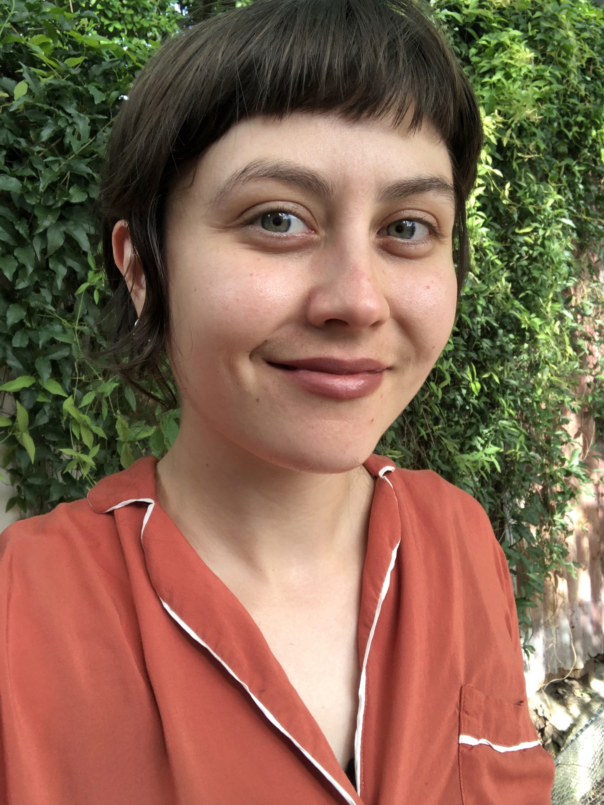
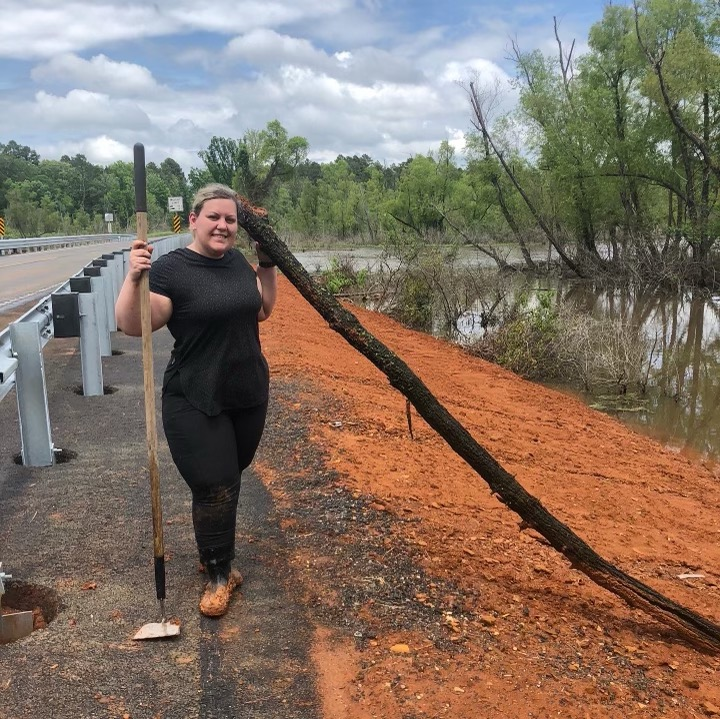
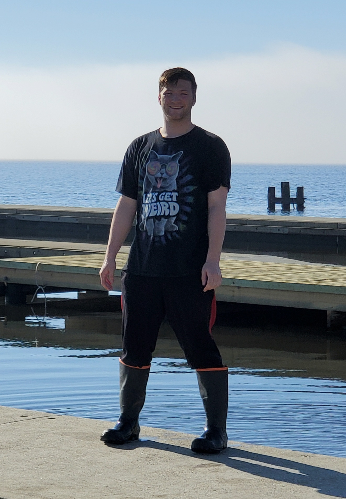
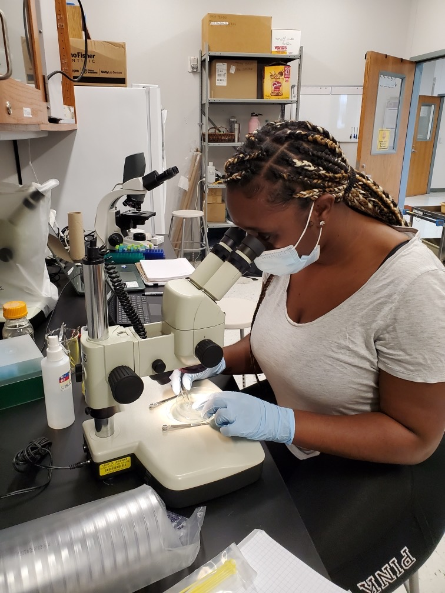
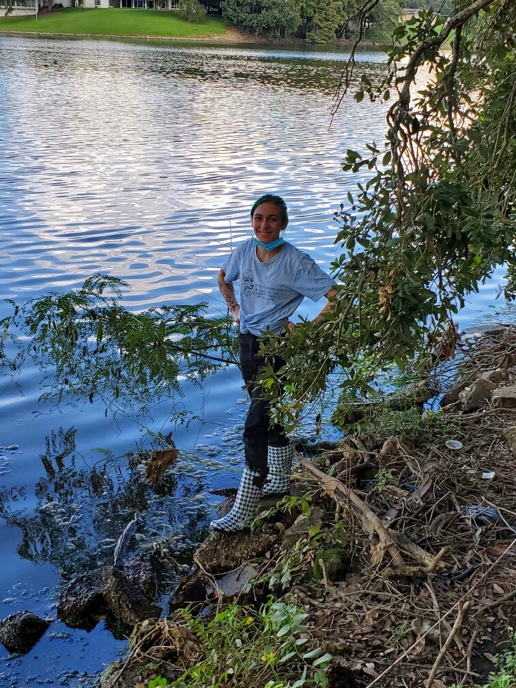
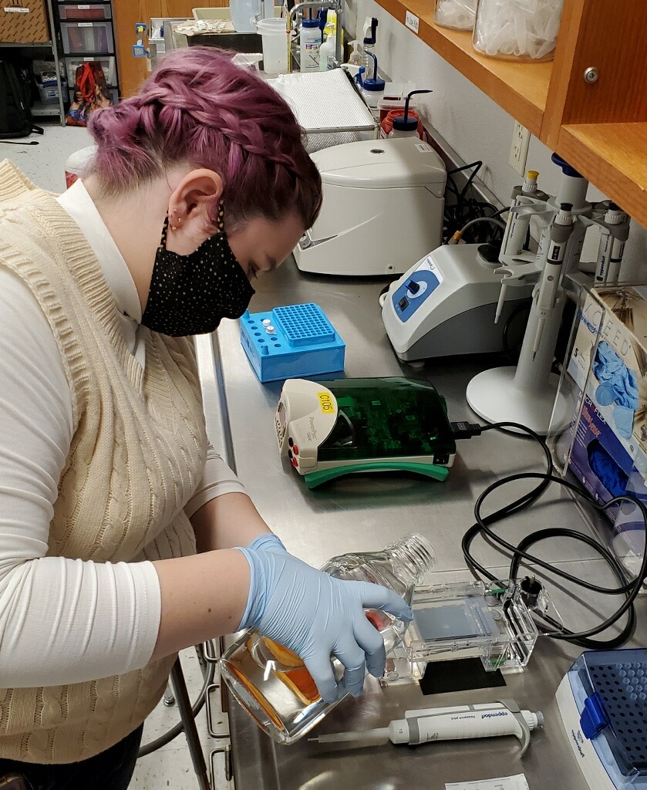

 
The Louisiana Freshwater Sponge Research Team consists of Biology, Computer Science, and Pre-Engineering BRCC students. All have individual roles in the projects that come together to create an ongoing database that allows us to understand the health of freshwater sponges in Louisiana!
 
 

{width=75%}

 Pictured above (from left to right): Raven Skelton, Tarry Glover, Samuel Joseph Johnson, Abhi Mehrotra, and Axel  Henriquez. 

 
 

**Undergraduate Research Mentors:**
 
 
{width=25%}
 
Kenzie M. Cooke
 
Summer 2021 - 
 
"In the lab, my duties focus on scanning electron microscopy, and species identification by spicule morphology. I also love being in the field and I am scuba certified! I am pursuing a Bachelor's Degree in Marine Biology."

 
 
{width=25%}
 
Abhi Mehrotra
 
Summer 2021 -
 
"I am the first computer science major to have received the amazing opportunity to be part of The Louisiana Freshwater Sponge Project! My responsibilities in the lab include webmaster, data management, and I also do fieldwork as well. My goals are to graduate with an Associate Degree in Computer Science from BRCC and pursue a Bachelor's Degree in Computer Science with a concentration in Data Science plus a minor in Biology at Southeastern Louisiana University."

 
 
{width=25%}
 
Ariel D. Viator
 
Spring 2020 -
 
"Being in the outdoors, sponge hunting, and research are some of my favorite things to do. At the end of December 2021, I will be graduating from BRCC and getting my Associate Degree in science. I will be continuing my education at FranU to get my Bachelor’s degree in Medical Laboratory Science, while continuing the Sponge adventures."
 
 

**Undergraduate Student Researchers:**
 
 
{width=25%}
 
Lisa DiMaggio
 
Spring 2022 -
 
"I am currently a nursing major. This opportunity to work in work in a laboratory setting is starting to sway my decision! Who knows where I will find myself in a couple of years. Mu role in the Louisiana Freshwater Sponge Project is spicule prep."

 
 
{width=25%}
 
Tarry Glover
 
Summer 2020 -
 
"My name is Tarry Glover. I joined the Freshwater Sponge Project in 2020. I work with MEGA-X software and the NCBI database as well as water analysis. After I graduate, I plan on transferring to Fran U and completing the Medical Laboratory Science Program."

 
 
{width=25%}
 
Axel Henriquez
 
Spring 2022 -
 
"My role on the Louisiana Freshwater Sponge Project is to analyze a variety of soil samples gathered from previous sponge hunting trips, in hopes of finding spicules. I will be graduating this semester with my Associate Degree in Biology, and will be applying to nursing school in hopes to attend in Fall 2022."

 
 
{width=25%}
 
Samuel J. Johnson
 
Fall 2021 -
 
"I joined the Freshwater Sponge Project by chance because I wanted to expand my horizons, but I have thoroughly enjoyed my time in the project. My major may be engineering, but the project has given me many skills that I can use in my own major."

 
 
{width=25%}
 
Britney Lee
 
Fall 2021 -
 
"My duties in the lab are preparing samples for identification or DNA isolation as well as learning light microscopy. I am enjoying this opportunity very much and I plan on using these transferable skills as I began physician’s assistance school in the future!"

 
 
{width=25%}
 
Raven Skelton
 
Fall 2021 -
 
"I primarily focus on spicule prep, going out in the field and data entry with more to learn. I've worked and lived in national parks, I love to hike, and spend time outdoors. When I graduate from BRCC, I hope to take the next steps to pursue a career in restoration ecology."

 
 
{width=25%}
 
Kendall White
 
Spring 2022 -
 
" "
 
 

 
 
{width=25%}
 
Raven Worley
 
Fall 2021 -
 
"I currently work in the molecular part of the project; I find enjoyment in the process from DNA Isolation to PCR Purification, especially working with Gel Electrophoresis. Once I graduate, I plan to further my education to achieve my ultimate career goal of working as a Zoologist."
 
 

**High School Student Researchers:**
 
 
{width=25%}
 
Makayla Collins
 
Fall 2021 -
 
" "
 
 

**Previous Research Mentors:** these students trained students on molecular techniques, sponge collection, and sponge dissection. These students are always available for outreach opportunities and are 100% dedicated to the Freshwater Sponge Survey, even after they graduate.
 
 
Heyer, Matthew: Fall 2019 - Summer 2021
 
Vuong, Chau: Summer 2019 - Spring 2021
 
 

**Previous Undergraduate Student Researchers:**
 
 
Arroyo, Elsa: Summer 2020 - Summer 2021
 
Boone, Cristina: Summer 2020 - Spring 2021
 
Ciarlini, Duda: Fall 2021
 
Smith, Charmaine: Summer 2019 - Spring 2020
 
 

**Previous Summer Research Interns:** these students dedicated their summer to studying sponges and contributing to the Louisiana database
 
 
Summer 2020:
 
Harris, Jonathan
 
Moore, Quinton
 
 
Summer 2019:
 
Curvin, Diamonique
 
Moore, Quinton
 
Santos, Daisy
 
Vanichchagorn-Howell, Cole
 
 

**Curriculum Developers:** these students were involved in developing the CURE curriculum for the implementation of the Freshwater Sponge Survey in the second Biology Lab at BRCC.
 
 
Hanna, Lauren: Summer 2021
 
Hogan, Michael: Summer 2019
 
Lee, Rebecca: Summer 2020
 
Roussel, Ori: Summer 2019
