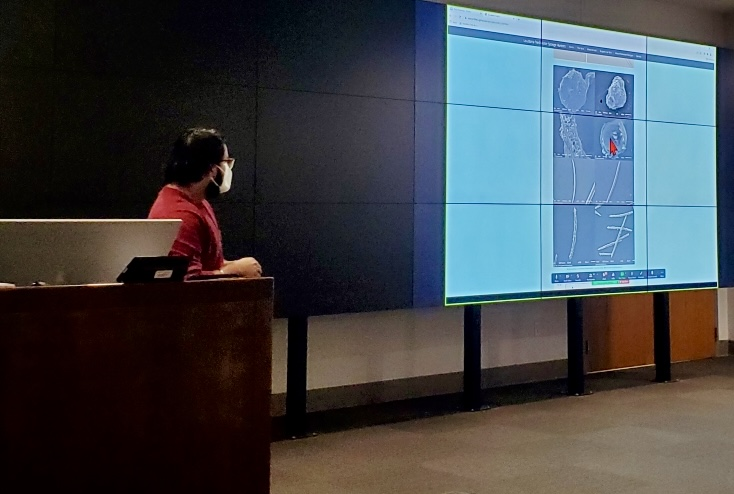
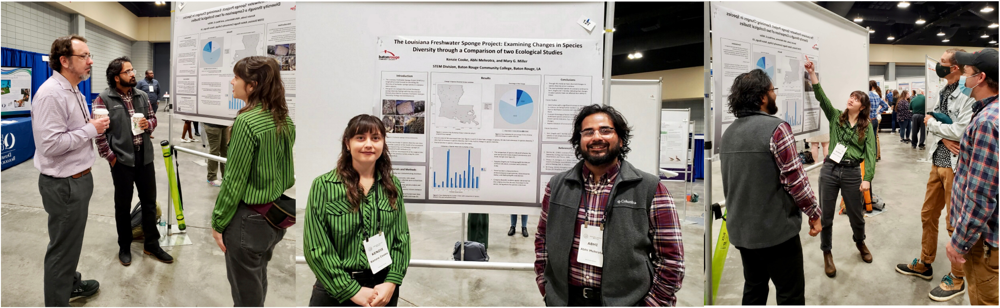

{width=75%}

 Pictured above: Mentor Abhi Mehrotra sharing information about the Freshwater Sponge Project to other BRCC students. 

 
 

**Presentations:** 
 
 

{width=75%}

 Pictured above: The Louisiana Freshwater Sponge Research Team presenting posters about the Freshwater Sponge Project at LSU Discover Day 2022. 

 
 
Glover, Tarry, White, Kendall, Lee, Brittany, Mehrotra, Abhi, and Miller, M.G. _Driving Water Parameters of the three most abundant Freshwater Sponge Species in Louisiana_, Louisiana State University, Discover Day, 2022.
 
 
Henriquez, Axel, Dimaggio, Lisa, Bieller, Amori, Cooke, Kenzie, and Miller, M.G. _Can Sediment Analysis be used to Further Describe Species Diversity of Freshwater Sponges?_, Louisiana State University, Discover Day, 2022.
 
 
Skelton, Raven, Collins, Makayla, Mehrotra, Abhi, and Miller, M.G. _Understanding preferred substrates of Louisiana Freshwater Sponges_, Louisiana State University, Discover Day, 2022.
 
 

{width=75%}

 Pictured above: Mentors Kenzie Cooke and Abhi Mehrotra presenting their poster at the 2022 Annual Conference for the Association of Southeastern Biologists. 

 
 
Cooke, Kenzie, Mehrotra, Abhi, and Miller, M.G. _The Louisiana Freshwater Sponge Project: Examining Changes in Species Diversity through a Comparison of two Ecological Studies_, Association of Southeastern Biologists, Annual Conference Presentation, 2022.
 
 
Miller, M.G., _Building a CURE for Your Monotonous Labs_, Louisiana Academy of Sciences, Peer Lecture Presentation, 2021.
 
 
Boone, C., _Inducing Spicule Malformations Within Freshwater Sponges by Relocation_, Association of Southeastern Biologists, Annual Conference Presentation, 2021.
 
 
Viator, A. and Elsa Arroyo, _Identifying Freshwater Sponges Along with Creating a New Database_, Association of Southeastern Biologists, Annual Conference Presentation, 2021.
 
 
Vuong, C. and M. Heyer, _Defining Louisiana Freshwater Sponge diversity with COX1-R1 and COX1-D2 Barcoding: A Database Development Study for Classroom Curriculum_, Association of Southeastern Biologists, Annual Conference Presentation, 2021.
 
 
Miller, M.G., _The Louisiana Freshwater Sponge Survey Project: Identifying, Characterizing, and Building a Molecular Database_, LUMCON Scientific Talks, 2020.
 
 

<iframe width="560" height="315" src="https://www.youtube.com/embed/BKFM70051Ag" title="YouTube video player" frameborder="0" allow="accelerometer; autoplay; clipboard-write; encrypted-media; gyroscope; picture-in-picture" allowfullscreen></iframe>

 
 
Miller, M.G., _Changing the Curriculum to Involve Students in Research Activities_, Louisiana Science Teachers Association, Annual Conference Presentation, 2019.
 
 

**Publications:**
 
 
Exciting publications are coming soon!! Please check back.