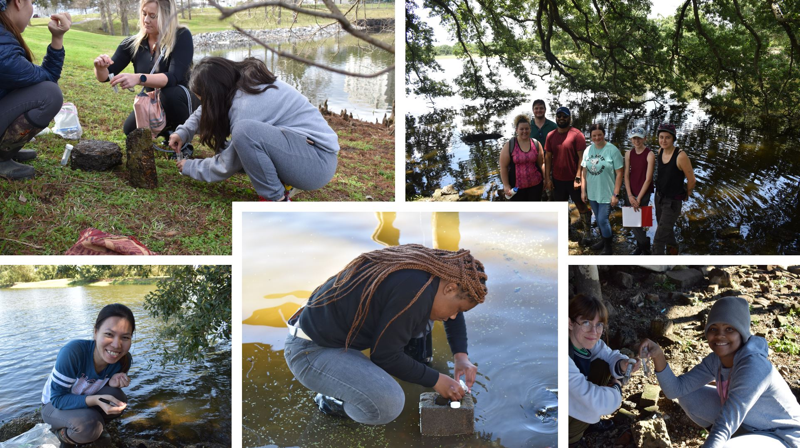

 

Baton Rouge Community College engages students in freshwater sponge research through
a [Course-based undergraduate Research Experience](https://science.sciencemag.org/content/360/6396/1417.6) during their 
second year biology lab. This course is designed for the students to develop critical thinking skills, molecular skills, increase scientific literacy, and allow them
to contribute to a larger pool of scientific knowledge. The course data has also 
shown to increase student self-identity as a scientist, growth in scientific communication, and growth in academic self-confidence.
 
 

{width=75%}

 
 
BRCC students can also participate in summer internships where they expand their knowledge of freshwater sponges and work on research projects to answer specific questions related to sponge diversity and morphology, environmental influences, and genetic variation.
 
 
BRCC students are also involved in [outreach activities](outreach.html) and near-peer mentoring to bring research activities to local high school students.