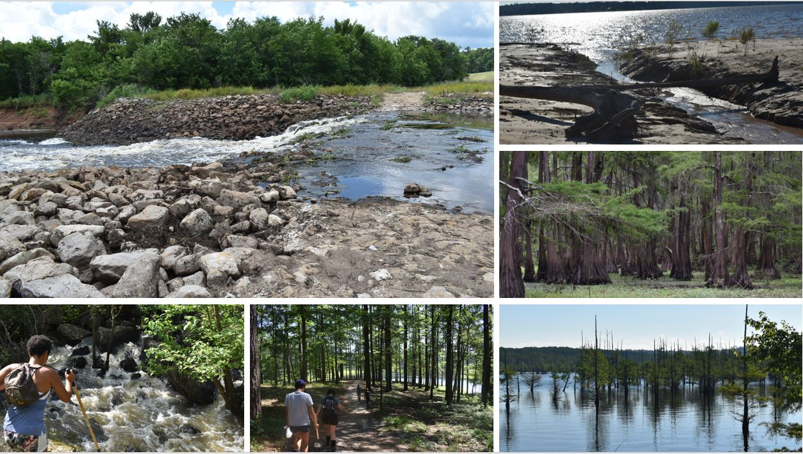

```{=html}
<style type="text/css">
h1.title {
  font-size: 45px;
  text-align: center;
}
body {
background-color: #B9F2FE
}
</style>
```
<br>

The Louisiana Freshwater Sponge survey began in the spring 2018 with a group of BRCC students led by Dr. Miller. This began an enthusiastic journey!
<br>
<br>
<center>
{width=50%}
</center>
<br>
<br>
In summer 2019, the "hunt" was in full affect. Dr. Miller led a group of students on a state wide survey. This trip lasted 4 days, and covered 35 parishes! They would spend the summer creating a course curriculum that would be used by BRCC students and for outreach.
<br>
<br>
<center>
{width=75%}
</center>


